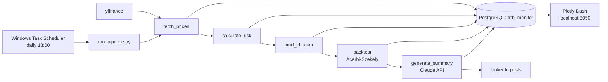

# FRTB IMA Risk Monitor


> A daily, automated FRTB Internal Models Approach risk monitor: Historical-
> Simulation VaR / Expected Shortfall, stress calibration, liquidity-horizon
> scaling, weekly Acerbi-Szekely backtesting, and Claude-generated narratives —
> on a synthetic multi-asset trading book, served to a live Plotly Dash
> dashboard and a PostgreSQL backend.

## 1. Project Overview

An automated, daily-scheduled risk-monitoring system that computes FRTB
Internal Models Approach (IMA) risk metrics on a synthetic six-asset trading
book, runs weekly Expected Shortfall backtests, flags Non-Modellable Risk
Factors, and auto-generates LinkedIn-ready narratives with the Claude API. It
writes to PostgreSQL and serves a live Plotly Dash dashboard.

## 2. What is FRTB IMA

FRTB (Fundamental Review of the Trading Book) is the Basel Committee's market
risk capital framework. Its Internal Models Approach lets banks use their own
models to compute capital, but requires Expected Shortfall (not just VaR) at
97.5% confidence, capital scaled by asset-class liquidity horizons, a punitive
add-on for Non-Modellable Risk Factors, and regular ES backtesting. This project
implements a simplified, transparent version of each of those pieces.

## 3. Methodology

**Value at Risk (VaR).** Historical Simulation on a 252-day rolling window of
equal-weighted portfolio returns: VaR(97.5%) is the negated 2.5th percentile of
returns, reported as a positive loss magnitude. No distributional assumptions
are made.

**Expected Shortfall (ES).** From the same window, ES is the negated mean of all
returns at or below the VaR threshold, i.e. the average loss on the worst 2.5%
of days. ES is more conservative than VaR and is the FRTB-mandated measure.

**Stress calibration.** The single worst 252-day window in the full history
(2007 to present) is found by taking the maximum rolling ES. The stressed ES is
then `0.5 * stress_period_es + 0.5 * current_es` (floored at the current ES), a
simplified analogue of the FRTB stressed-ES blend.

**Liquidity-horizon adjustment.** FRTB assigns each risk class a liquidity
horizon. Each asset's ES is scaled by `sqrt(horizon / 10)` (square-root-of-time)
and weighted into a portfolio liquidity-adjusted ES, so less-liquid exposures
(e.g. 60-day rates) attract proportionally more capital.

**Backtesting.** Every Friday the Acerbi-Szekely Z2 statistic compares realised
returns on VaR-breach days against predicted ES (using the prior day's forecast,
so there is no look-ahead). Z2 near 0 means the model is well calibrated; Z2
below -0.2 fails, signalling ES is underestimating tail risk.

**Sign convention.** VaR and ES are stored as positive loss magnitudes. This is
the standard risk-reporting convention and makes the Acerbi-Szekely indicator
`1(R_t < -VaR_t)` behave correctly.

## 4. How Claude Code and the Claude API Were Used

**Claude Code (architecture and implementation).** Used to design the module
layout, write every pipeline stage, and iteratively test each component in
isolation before integration. Notable judgement calls Claude Code surfaced and
documented: adding a `price_history` table and a shared `config.py` (neither in
the original spec) to keep the modules DRY and decoupled from the network;
reconciling a sign-convention contradiction between the VaR/ES and backtest
specs; and flagging that the originally specified Claude model was deprecated and
would retire weeks after launch.

**Claude API (narrative generation).** `narrative/generate_summary.py` calls the
Claude API (`claude-sonnet-4-6`) to turn the day's metrics into a one-line
LinkedIn post, and on Fridays a ~150-word weekly narrative covering ES drivers,
the backtest verdict, the top liquidity-capital contributor, and a
forward-looking regime note.

## 5. Tech Stack

- **Python 3.13** - pipeline, risk math (pandas, numpy, scipy)
- **PostgreSQL 18** - storage, accessed exclusively via **SQLAlchemy**
- **yfinance** - daily price data
- **Anthropic Claude API** - narrative generation
- **Plotly Dash** - dashboard
- **Windows Task Scheduler** - daily automation
- **python-dotenv** - secret management (keys never hardcoded)

## Architecture

`run_pipeline.py` orchestrates the daily flow; every stage reads from and writes
to PostgreSQL, and the dashboard reads the same tables live.



## 6. Setup Instructions

```powershell
# 1. Install dependencies
python -m pip install -r requirements.txt

# 2. Fill in secrets (this file is git-ignored)
#    Edit .env and set DB_PASSWORD and ANTHROPIC_API_KEY

# 3. Create the database and tables (idempotent)
python database/db_utils.py

# 4. Run the full pipeline once
python pipeline/run_pipeline.py

# 5. Launch the dashboard -> http://127.0.0.1:8050
python dashboard/app.py
```

The pipeline is wired into Windows Task Scheduler for daily execution; it calls
`pipeline/run_pipeline.py` with the absolute Python path and logs to
`outputs/pipeline_log.txt`.

## 7. Sample Output

All charts below are generated from the live database by
`dashboard/make_visuals.py` (regenerate any time with
`python dashboard/make_visuals.py`).

| Expected Shortfall vs VaR | Volatility Regime |
|---|---|
|  |  |
| **Per-Asset ES Contribution** | **Acerbi-Szekely Backtest (Z2)** |
|  |  |

The interactive version of these four panels is the Plotly Dash dashboard at
`http://127.0.0.1:8050` (run `python dashboard/app.py`).

## 8. Key Findings

From the first full run (data through 2026-05-27, ~19 years of history):

- **Current state:** the book is in a *stressed* volatility regime. One-day
  ES(97.5%) is **1.56%** versus VaR **1.16%** — ES exceeds VaR by ~34%, the
  expected tail-thickness gap that motivates FRTB's switch from VaR to ES.
- **Stress calibration:** the stressed ES is **2.47%**, anchored to the worst
  252-day window in the full history (ES **3.38%**, the 2008-09 GFC period).
- **Liquidity dominates capital:** the liquidity-adjusted ES is **3.36%**, about
  2.2x the unadjusted ES. The driver is TLT (rates, 60-day horizon), whose
  sqrt(60/10) = 2.45x scaling makes the least-liquid sleeve the largest capital
  contributor — exactly the behaviour FRTB's liquidity horizons are designed to
  capture.
- **NMRF:** 0 of 6 assets flagged, as expected for liquid ETFs. The
  classification still runs daily so the infrastructure is in place.
- **Backtesting:** across 863 historical weeks, 398 PASS / 465 FAIL. Failures
  cluster around volatility regime shifts (2008, 2020, 2022), where a 252-day
  historical-simulation ES under-reacts to sudden spikes and Z2 falls below
  -0.2. The most recent week (ending 2026-05-22) passes with Z2 = -0.19. This is
  the headline insight: a simple rolling-window ES is materially pro-cyclical,
  which is why FRTB layers a stressed-ES floor on top of it.
