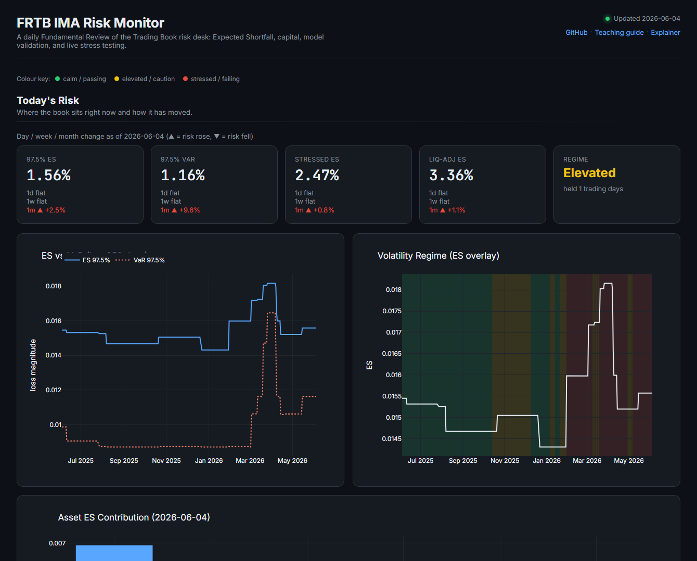
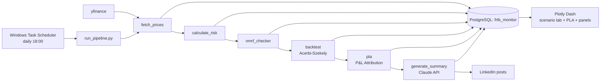
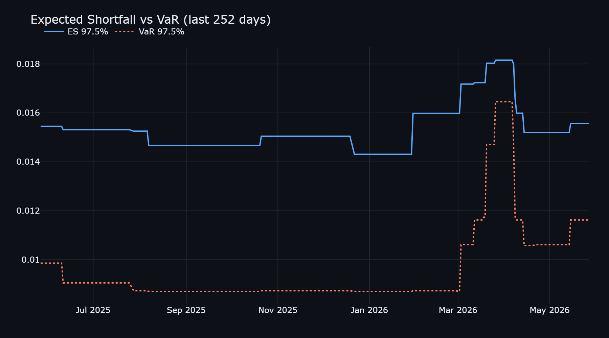
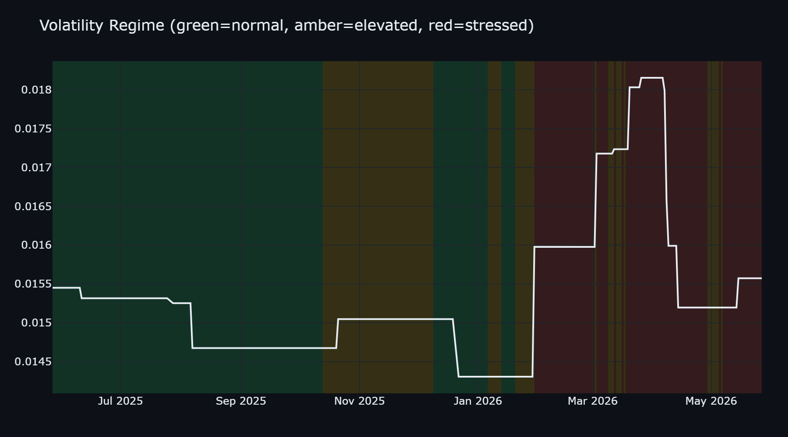
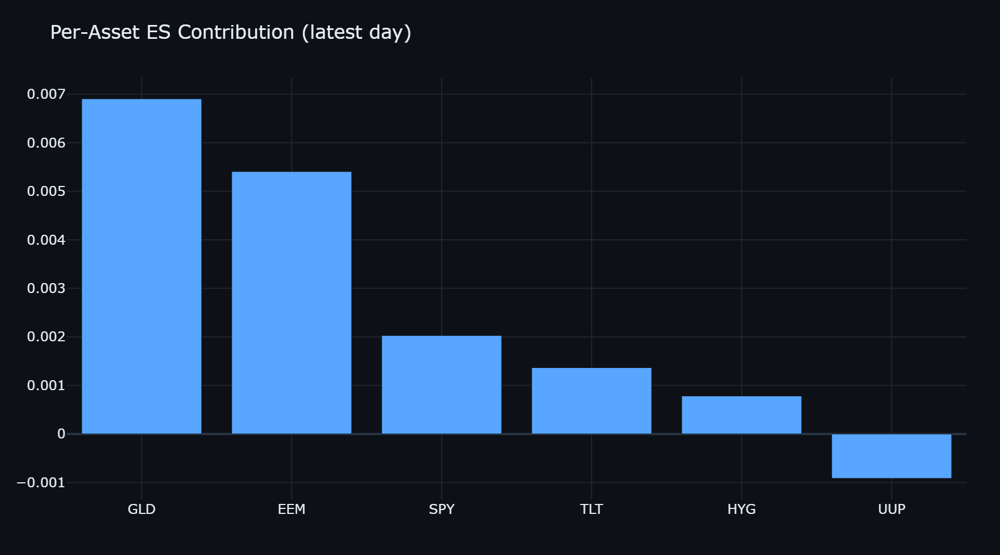
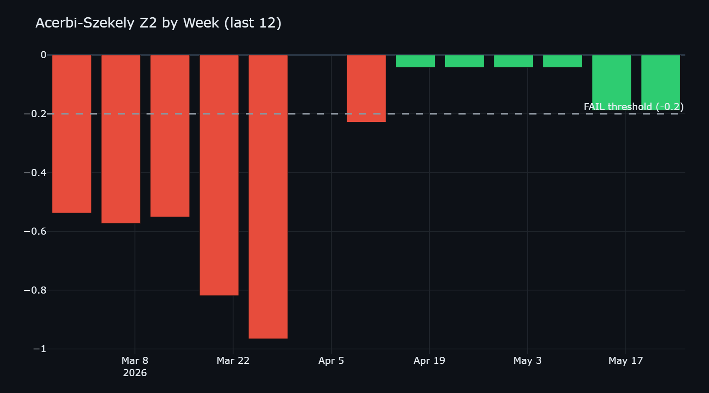
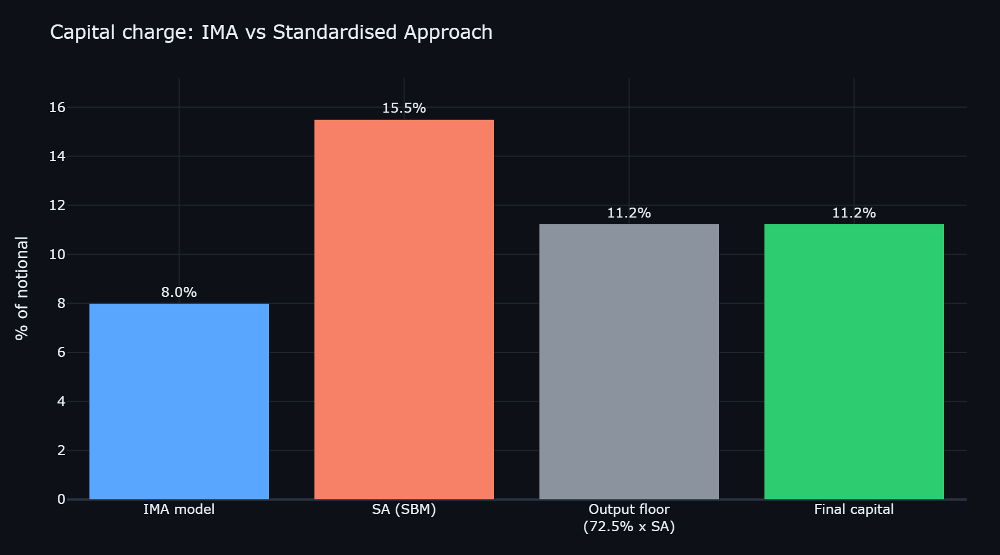

# FRTB IMA Risk Monitor

[](https://frtb-ima-risk-monitor.onrender.com/)
[](https://github.com/marksguo/frtb-ima-risk-monitor/actions/workflows/ci.yml)




**Live dashboard:** https://frtb-ima-risk-monitor.onrender.com/, interactive, served from a point-in-time data snapshot. (Free hosting tier: the first load after a period of inactivity may take ~30-60s to wake up.)

**New to these concepts?** [`TEACHING.md`](TEACHING.md) explains the entire project from scratch for a reader with no finance background, defining every acronym. [`EXPLAINER.md`](EXPLAINER.md) is a shorter plain-English tour of the daily numbers.

> A daily, automated FRTB Internal Models Approach risk monitor: Historical-
> Simulation VaR / Expected Shortfall, stress calibration, liquidity-horizon
> scaling, weekly Acerbi-Szekely backtesting, the FRTB P&L Attribution test,
> marginal/component VaR sensitivity analysis, an interactive scenario/stress
> lab, and Claude-generated narratives, on a synthetic multi-asset trading book,
> served to a live Plotly Dash dashboard and a PostgreSQL backend.

## Contents

- [Project Overview](#1-project-overview)
- [What is FRTB IMA](#2-what-is-frtb-ima)
- [Methodology](#3-methodology)
- [How Claude Code and the Claude API Were Used](#4-how-claude-code-and-the-claude-api-were-used)
- [Tech Stack](#5-tech-stack)
- [Architecture](#architecture)
- [Setup Instructions](#6-setup-instructions)
- [Sample Output](#7-sample-output)
- [How to Read the Dashboard](#how-to-read-the-dashboard)
- [Key Findings](#8-key-findings)
- [Limitations & Open Questions](#limitations--open-questions)
- [Methodology Notebook](#methodology-notebook)
- [Testing](#testing)

## 1. Project Overview

An automated, daily-scheduled risk-monitoring system that computes FRTB
Internal Models Approach (IMA) risk metrics on a synthetic six-asset trading
book, runs weekly Expected Shortfall backtests, flags Non-Modellable Risk
Factors, and auto-generates LinkedIn-ready narratives with the Claude API. It
writes to PostgreSQL and serves a live Plotly Dash dashboard.

## 2. What is FRTB IMA

FRTB (Fundamental Review of the Trading Book) is the Basel Committee's market
risk capital framework. Its Internal Models Approach lets banks use their own
models to compute capital, but requires Expected Shortfall (not just VaR) at
97.5% confidence, capital scaled by asset-class liquidity horizons, a punitive
add-on for Non-Modellable Risk Factors, and regular ES backtesting. This project
implements a simplified, transparent version of each of those pieces.

## 3. Methodology

**Value at Risk (VaR).** Historical Simulation on a 252-day rolling window of
equal-weighted portfolio returns: VaR(97.5%) is the negated 2.5th percentile of
returns, reported as a positive loss magnitude. No distributional assumptions
are made.

**Expected Shortfall (ES).** From the same window, ES is the negated mean of all
returns at or below the VaR threshold, i.e. the average loss on the worst 2.5%
of days. ES is more conservative than VaR and is the FRTB-mandated measure.

**Stress calibration.** The single worst 252-day window in the full history
(2007 to present) is found by taking the maximum rolling ES. The stressed ES is
then `0.5 * stress_period_es + 0.5 * current_es` (floored at the current ES), a
simplified analogue of the FRTB stressed-ES blend.

**Liquidity-horizon adjustment.** FRTB assigns each risk class a liquidity
horizon. Each asset's ES is scaled by `sqrt(horizon / 10)` (square-root-of-time)
and weighted into a portfolio liquidity-adjusted ES, so less-liquid exposures
(e.g. 60-day rates) attract proportionally more capital.

**Backtesting.** Every Friday the Acerbi-Szekely Z2 statistic compares realised
returns on VaR-breach days against predicted ES (using the prior day's forecast,
so there is no look-ahead). Z2 near 0 means the model is well calibrated; Z2
below -0.2 fails, signalling ES is underestimating tail risk.

**Sign convention.** VaR and ES are stored as positive loss magnitudes. This is
the standard risk-reporting convention and makes the Acerbi-Szekely indicator
`1(R_t < -VaR_t)` behave correctly.

**Comparison estimators.** Alongside production Historical Simulation, the project
computes parametric (Normal) and Monte Carlo (Student-t) VaR/ES, plus a
volatility-scaled **Filtered Historical Simulation** (EWMA), to show how the
distributional assumption and volatility-responsiveness change the tail estimate
(`pipeline/var_methods.py`). Two further VaR backtests - **Kupiec POF** and
**Christoffersen** independence/conditional-coverage - complement Acerbi-Szekely
(`pipeline/var_backtests.py`).

**Capital and the Standardised Approach floor.** A simplified FRTB Standardised
Approach (SBM delta) charge (`pipeline/standardised_approach.py`) is compared to
an approximate IMA capital charge (multiplier x liquidity-adjusted stressed ES),
with the Basel III **output floor** applied: final capital = max(IMA, 72.5% x SA)
(`pipeline/capital.py`). This shows which approach binds.

**P&L Attribution (PLA) test.** A required IMA-eligibility gate (FRTB MAR32.16),
implemented in `pipeline/pla.py`. Over a rolling 250-day window it compares the
desk's **Hypothetical P&L** (the full-revaluation book return) against a
**Risk-Theoretical P&L** built only from the risk factors the model retains
(equity and rates, via an in-window OLS projection). Two statistics - the
**Spearman** rank correlation and the **Kolmogorov-Smirnov** distance between the
two P&L distributions - map to a green / amber / red traffic light, with the
desk's zone the worse of the two: green keeps IMA, amber adds a capital
surcharge, red forces the Standardised Approach. The factor-projection RTPL is a
synthetic stand-in for a bank's pricing-engine RTPL; it reproduces the mechanism
the test polices (omitted or approximated risk factors widen the gap) rather than
an exact regulatory number.

**Interactive scenario lab.** `pipeline/scenario.py` recomputes the full metric
set under a user-chosen stress: a volatility multiplier applied to the current
risk window, plus instantaneous directional shocks by FRTB risk class (appended
as a hypothetical scenario day). Only the latest date is evaluated
(trailing-window quantiles, with the historical stress level read from storage),
so a full recompute is ~10 ms and the dashboard sliders update live. The lab
shows VaR, ES, stressed and liquidity-adjusted ES, the regime, and the IMA-vs-SA
capital outcome moving together, including regime flips and changes in which
capital approach binds.

**Sensitivity analysis.** `pipeline/sensitivity.py` reports **marginal VaR**
(how portfolio VaR moves when one position is nudged) and **component VaR**
(each asset's additive share of today's VaR, summing back to the total via
Euler's theorem), plus a **parameter grid** of VaR/ES across confidence levels
and look-back windows. Component VaR can go negative, surfacing positions that
act as hedges, and the grid shows how much the headline number depends on
modelling choices versus the market.

## 4. How Claude Code and the Claude API Were Used

**Claude Code (architecture and implementation).** Used to design the module
layout, write every pipeline stage, and iteratively test each component in
isolation before integration. Notable judgement calls Claude Code surfaced and
documented: adding a `price_history` table and a shared `config.py` (neither in
the original spec) to keep the modules DRY and decoupled from the network;
reconciling a sign-convention contradiction between the VaR/ES and backtest
specs; and flagging that the originally specified Claude model was deprecated and
would retire weeks after launch.

**Claude API (narrative generation).** `narrative/generate_summary.py` calls the
Claude API (`claude-sonnet-4-6`) to turn the day's metrics into a one-line
LinkedIn post, and on Fridays a ~150-word weekly narrative covering ES drivers,
the backtest verdict, the top liquidity-capital contributor, and a
forward-looking regime note.

## 5. Tech Stack

- **Python 3.13** - pipeline, risk math (pandas, numpy, scipy)
- **PostgreSQL 18** - storage, accessed exclusively via **SQLAlchemy**
- **yfinance** - daily price data
- **Anthropic Claude API** - narrative generation
- **Plotly Dash** - dashboard
- **Windows Task Scheduler** - daily automation
- **python-dotenv** - secret management (keys never hardcoded)
- **pytest + GitHub Actions** - unit-tested risk math, CI on every push
- **Docker + docker-compose** - one-command reproducible stack

## Architecture

`run_pipeline.py` orchestrates the daily flow; every stage reads from and writes
to PostgreSQL, and the dashboard reads the same tables live.



## 6. Setup Instructions

```powershell
# 1. Install dependencies
python -m pip install -r requirements.txt

# 2. Fill in secrets (this file is git-ignored)
#    Edit .env and set DB_PASSWORD and ANTHROPIC_API_KEY

# 3. Create the database and tables (idempotent)
python database/db_utils.py

# 4. Run the full pipeline once
python pipeline/run_pipeline.py

# 5. Launch the dashboard -> http://127.0.0.1:8050
python dashboard/app.py
```

The pipeline is wired into Windows Task Scheduler for daily execution; it calls
`pipeline/run_pipeline.py` with the absolute Python path and logs to
`outputs/pipeline_log.txt`.

### Run with Docker (no local Postgres needed)

`docker-compose.yml` provisions PostgreSQL and the app together:

```bash
docker compose up --build
# then open http://localhost:8050
```

To enable Claude narratives inside the container, pass your key:
`ANTHROPIC_API_KEY=sk-... docker compose up --build`.

## 7. Sample Output

All charts below are generated from the live database by
`dashboard/make_visuals.py` (regenerate any time with
`python dashboard/make_visuals.py`).

| Expected Shortfall vs VaR | Volatility Regime |
|---|---|
|  |  |
| **Per-Asset ES Contribution** | **Acerbi-Szekely Backtest (Z2)** |
|  |  |

**Capital: Internal Models Approach vs the Standardised Approach** (the internal
model gives a lower charge, but the Basel III output floor lifts final capital to
72.5% of the SA):



The interactive version of these four panels is the Plotly Dash dashboard at
`http://127.0.0.1:8050` (run `python dashboard/app.py`).

## How to Read the Dashboard

New to market risk? Here is the whole dashboard in plain language. Every value is
a **fraction of the portfolio's value**, so `0.0156` means **1.56%** (on a
$100,000 book, about $1,560).

**ES vs VaR over time (top-left)** - two ways to measure "a bad day":
- **VaR (Value at Risk)** is the flood-wall height: on roughly 39 of every 40
  days, the daily loss should stay below it (about 1.16% in the snapshot shown).
- **ES (Expected Shortfall)** is how deep the water gets on the rare days the wall
  is overtopped - the *average* loss on the worst ~1 day in 40 (about 1.56%). ES
  is always the higher line; when the two spread apart, the rare bad days are
  getting relatively more painful.

**Volatility regime (top-right)** - "volatility" is how wildly prices are swinging.
The background compares recent swings to the long-run norm: green = normal,
amber = elevated, red = stressed (crisis-like). Losses tend to grow when the
background turns red.

**Why ES sits on a 0.01-0.03 scale** - it is a daily loss as a fraction of the
book. Related figures: **stressed ES** recalibrates to a past crisis (a "what if
2008 returned" buffer), and **liquidity-adjusted ES** is larger still because some
holdings take weeks to unwind safely, leaving you exposed for longer.

**Asset ES contribution (bottom-left)** - an itemized bill of risk: which of the 6
holdings is driving most of today's potential bad-day loss. A taller bar means
that asset contributes more risk, which is where a manager would trim first.

**Weekly backtest (bottom-right)** - the "is the model any good?" check. The
Acerbi-Szekely **Z2** score is near 0 when the model is accurate and strongly
negative when it underestimated risk. **PASS** (green) means the model held up
that week; **FAIL** (red) means it understated risk (the pass line is Z2 = -0.2).
Across all history the model fails about 54% of weeks - not a bug but a real
finding: simple risk models react too slowly to sudden turbulence, which is
exactly why regulators require the extra stressed-capital buffer.

## 8. Key Findings

From the first full run (data through 2026-05-27, ~19 years of history):

- **Current state:** the book is in a *stressed* volatility regime. One-day
  ES(97.5%) is **1.56%** versus VaR **1.16%**, ES exceeds VaR by ~34%, the
  expected tail-thickness gap that motivates FRTB's switch from VaR to ES.
- **Stress calibration:** the stressed ES is **2.47%**, anchored to the worst
  252-day window in the full history (ES **3.38%**, the 2008-09 GFC period).
- **Liquidity dominates capital:** the liquidity-adjusted ES is **3.36%**, about
  2.2x the unadjusted ES. The driver is TLT (rates, 60-day horizon), whose
  sqrt(60/10) = 2.45x scaling makes the least-liquid sleeve the largest capital
  contributor, exactly the behaviour FRTB's liquidity horizons are designed to
  capture.
- **NMRF:** 0 of 6 assets flagged, as expected for liquid ETFs. The
  classification still runs daily so the infrastructure is in place.
- **Backtesting:** across 863 historical weeks, 398 PASS / 465 FAIL. Failures
  cluster around volatility regime shifts (2008, 2020, 2022), where a 252-day
  historical-simulation ES under-reacts to sudden spikes and Z2 falls below
  -0.2. The most recent week (ending 2026-05-22) passes with Z2 = -0.19. This is
  the headline insight: a simple rolling-window ES is materially pro-cyclical,
  which is why FRTB layers a stressed-ES floor on top of it.

## Limitations & Open Questions

This is a teaching/portfolio implementation; the simplifications below are
deliberate, and each is a direction for further work.

- **Liquidity-horizon scaling is simplified.** Real FRTB scales 10-day ES into
  five horizon buckets (10/20/40/60/120 days) and aggregates with a prescribed
  square-root formula; this project uses a per-asset `sqrt(LH/10)` weighted sum.
  *Open question: how far does the simplification sit from the regulatory formula?*
- **Capital figures are illustrative.** The IMA charge is approximated as
  multiplier x liquidity-adjusted stressed ES; the full IMCC also blends
  diversified/undiversified ES, the NMRF Stressed-ES add-on, and the Default Risk
  Charge. The SA uses representative (not per-vertex) risk weights and delta risk
  only - the linear ETF book has no vega or curvature.
- **The model fails ~54% of weekly backtests**, driven by volatility clustering
  that plain Historical Simulation reacts to slowly. *Open question: how much does
  the Filtered (EWMA) HS in the notebook raise the pass rate?*
- **NMRF is a flag, not a charge.** *Open question: how to translate
  non-modellability into the Stressed-ES add-on the rules require?*
- **PLA uses a proxy RTPL.** The P&L Attribution test (`pipeline/pla.py`) is
  implemented, but the Risk-Theoretical P&L is a reduced-factor (equity + rates)
  OLS projection rather than a pricing-engine output. *Open question: how would a
  richer retained-factor set move the desk between the amber and green zones?*
- **Synthetic, equal-weight, linear book** - no dynamic positions, options, or
  cross-asset tail dependence (copulas). *Open question: how would non-linear
  payoffs and joint tail risk change the numbers?*
- **Some institutional features are intentionally out of scope**, because the
  book does not warrant them: **option Greeks** (the six ETF positions are
  linear, so there is no vega/gamma to report), **counterparty/credit exposure**
  (this is a market-risk trading book, not a derivatives counterparty portfolio),
  and **true intraday/real-time risk** (a daily monitor does not need it). Each
  is a deliberate scoping choice, not an oversight.

## Methodology Notebook

For a deeper, plot-by-plot walk-through of the risk math - comparing Historical,
Normal, and Student-t VaR/ES, the rolling risk series, and Kupiec / Christoffersen
VaR backtests - see [`notebooks/methodology.ipynb`](notebooks/methodology.ipynb).
It renders with charts inline on GitHub and is self-contained (it pulls its own
market data, so no database is required to run it).

## Testing

The pure risk functions (VaR/ES, Acerbi-Szekely Z2, Kupiec POF, Christoffersen,
and NMRF classification) are covered by a `pytest` suite that runs in CI
([GitHub Actions](.github/workflows/ci.yml)) on every push:

```bash
pytest -q
```
